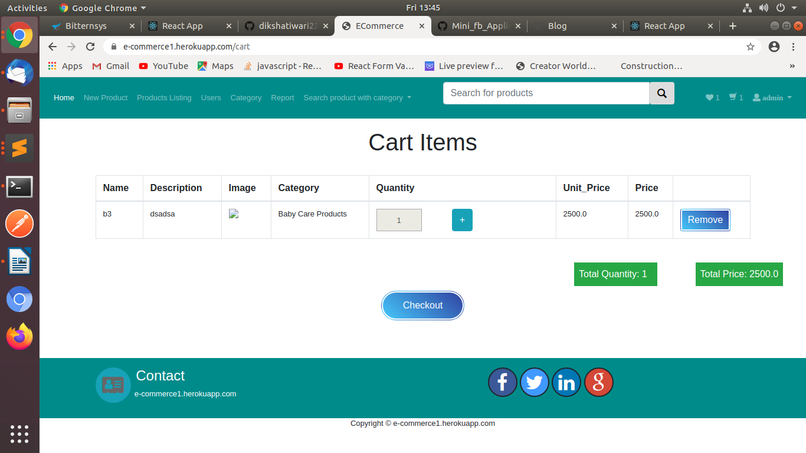
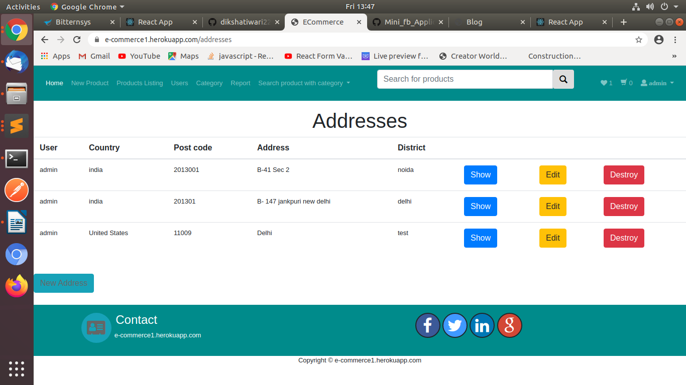
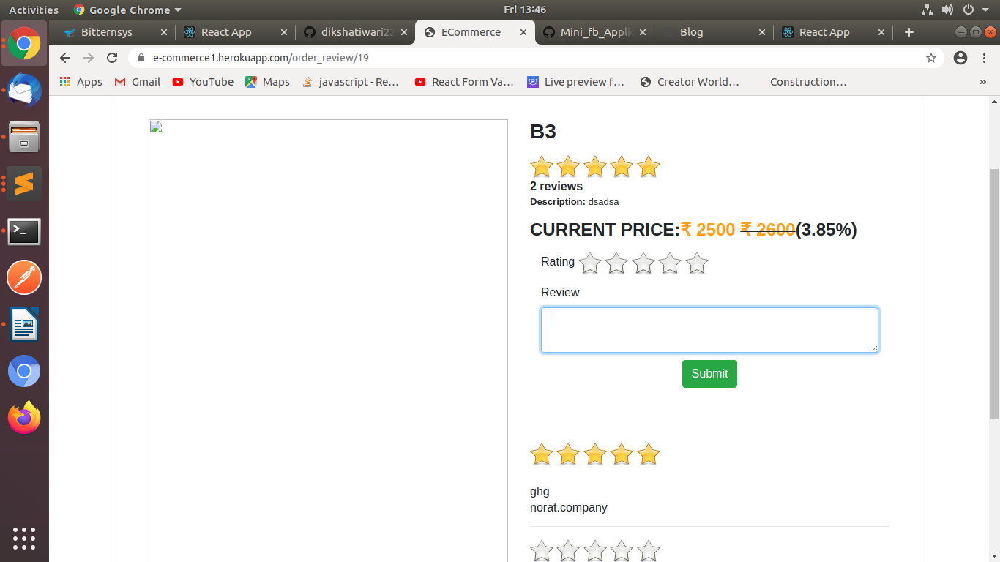

# README

This README would normally document whatever steps are necessary to get the
application up and running.

Things you may want to cover:

* Ruby version
    ruby '2.6.3'

* How to setup Project
    1. git clone https://github.com/dikshatiwari226/e-commerce-App.git
    2. run bundle install 
    3. rails db:create
    4. rails db:migrate

* Description

    E- Commerce simply stands for commercial businesses transacted over the internet or with the aid of electronic media. 
    The elements include:

    A functional website designed to appeal and attract clients and the target market.

    Product information on the site detailing the products/services and their respective features and prices

    An onsite search engine so that visitors can easily get what they want. 

    A shopping cart that displays to visitors the items they have selected and possibly the total value

    A relatively quick and painless checkout process for buyers. This makes shopping or buying on your site a sweet 
    experience and thus encourages return purchases and loyal customers.

    In this project i used stripe payement process software. Its allows individuals and businesses to make and receive 
    payments over the Internet.
    Stripe provides the technical, fraud prevention, and banking infrastructure required to operate online payment systems.

* ...

    

        
        
        
        
        
        
        
        
        
        
        
        
        
        
    

